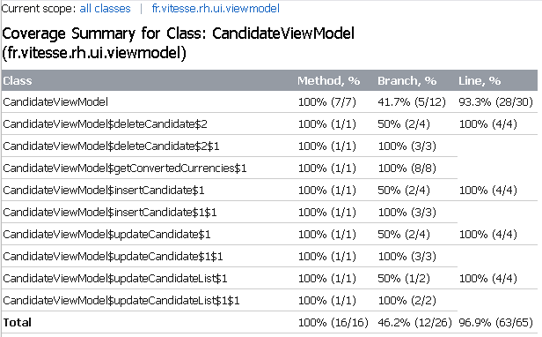

<!-- PROJECT LOGO -->
 

    

<h3 align="center">Vitesse RH</h3>

  

    A HR management app to track employee records efficiently.
     
     
    <a href="#summary"><strong>↓ Explore the docs ↓</strong></a>
     
     
    <a href="https://github.com/centraldave/openclassrooms-project-2-hr-management-app/issues">Report Bug</a>
    ·
    <a href="https://github.com/centraldave/openclassrooms-project-2-hr-management-app/issues">Report Feature</a>
  

<!-- TABLE OF CONTENTS -->

Table of Contents

  <ol>
    <li>
        <a href="#about-the-project">About The Project</a>
        <ul>
            <li><a href="#documentation">Couverture de tests</a></li>
        </ul>
    </li>
    <li>
      <a href="#documentation">Documentation</a>
      <ul>
        <li><a href="#documentation">Kanban, Wireframes</a></li>
      </ul>
    </li>
    <li><a href="#acknowledgements">Acknowledgements</a></li>
  </ol>

<!-- ABOUT THE PROJECT -->

## About The Project

Your project involves developing a mobile application for the automobile company Vitesse, designed to optimize the management of job candidates by their HR team. The app will allow HR to create, modify, and add candidates to their list, with the added functionality of marking them as favorites. You’ll be using the tech stack outlined in the company's Tech Radar, ensuring all features are implemented according to the provided wireframes, user stories, and color palette. With guidance from the Lead Developer, Sam, and the available information in the Kanban, you’ll be able to structure the app’s database and integrate unit tests to meet the Definition of Done. It’s your first independent Android development project!

### Test coverage 

#### ViewModel

<!-- DOCUMENTATION -->

## Documentation

### Kanban and Wireframes

<a href="https://openclassrooms.notion.site/cc6f493a33dd4b69803b9304e1450a94?v=4fd60dfc200d4658b9149fa6977121e3">Lien vers le Notion OpenClassroom</a>

<!-- ACKNOWLEDGEMENTS -->

## Acknowledgements

* [Project Assignment](https://openclassrooms.com/fr/projects/1744/)

[» Project Link](https://github.com/d2680807/openclassrooms_6th-project_money-transfer-system)

<!-- MARKDOWN LINKS & IMAGES -->
<!-- https://www.markdownguide.org/basic-syntax/#reference-style-links -->
